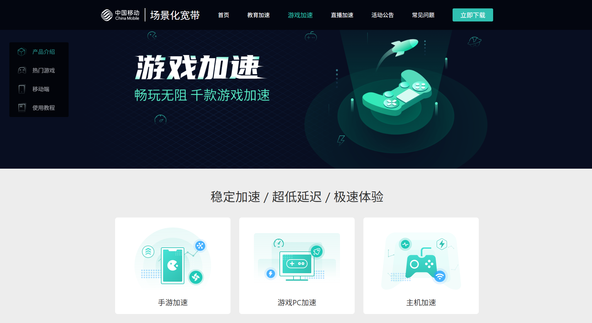
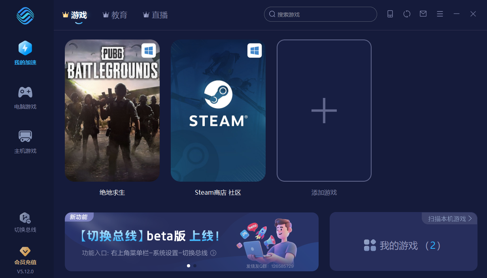
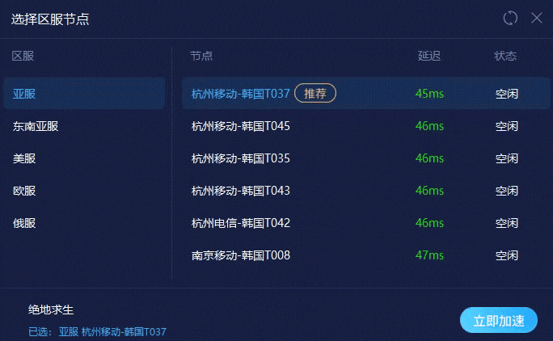
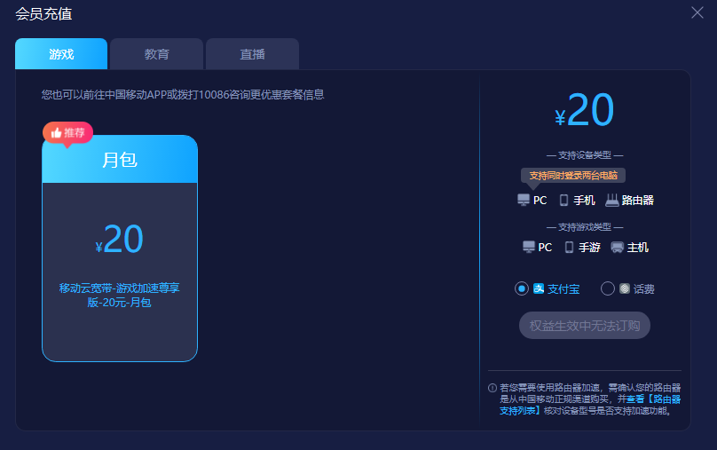

# 引言
大家好呀ヾ(＾-＾)ﾉ 这里是 Gucrin，今天打算给大家推荐一下我自己一直在用的加速器~

铛铛铛铛~ 它就是 —— 中国移动加速器！

这里把官网链接贴一下：[中国移动场景化宽带]( https://aifast.komect.com/)

可以看到官方起的名字还是挺高大上的，叫做场景化宽带，其实功能上和市面上常见的加速器产品是一样的。

# 推荐理由
这时候就有人问了，既然差不多为啥要推荐呢？请听我细细道来：

1. UI

可以看到软件 UI 还是挺简洁的，没有广告。:spoiler[对我来说下方的 Banner 是公告区，不算广告] 不过缺点是有点老气，而且没有很多动画，用起来有点卡顿。

2. 加速效果稳定

中国移动作为三大运营商之一，线路质量是很稳定有保障的，我平时主玩 PUBG，延迟能稳定在 50ms 以下，游戏体验很不错。而且线路是三网都有的，也就是移动联通电信都有加速线路~

4. 价格便宜
这里需要重点提一下了，也是我推荐的前提，你需要有一条中国移动的宽带，才能办理 3 元/月的游戏加速服务，不然原价订阅的话是 20 元/月，挺贵的。

# 总结
总结下来，还是因为便宜我才推荐的 hhh，只要 3 元每月，加速时长不限，而且加速游戏支持的也很多，总之有移动宽带的值得推荐🤓
