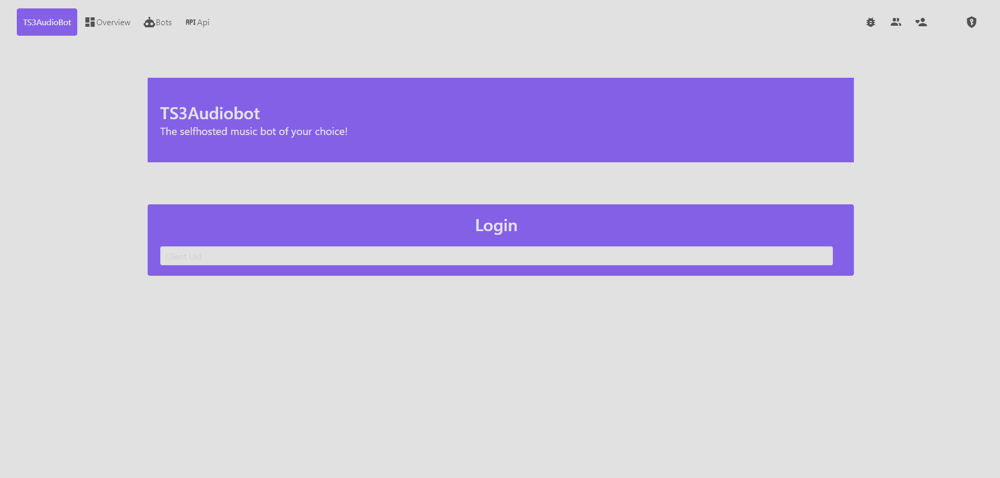
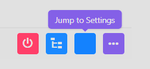
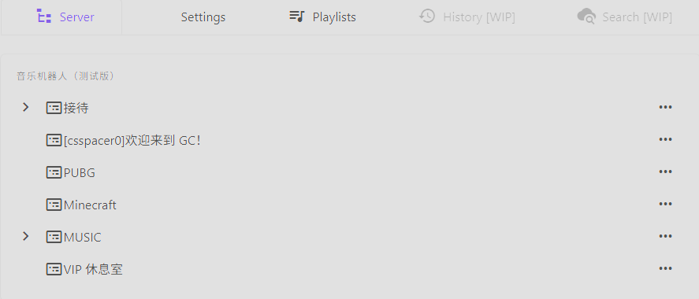
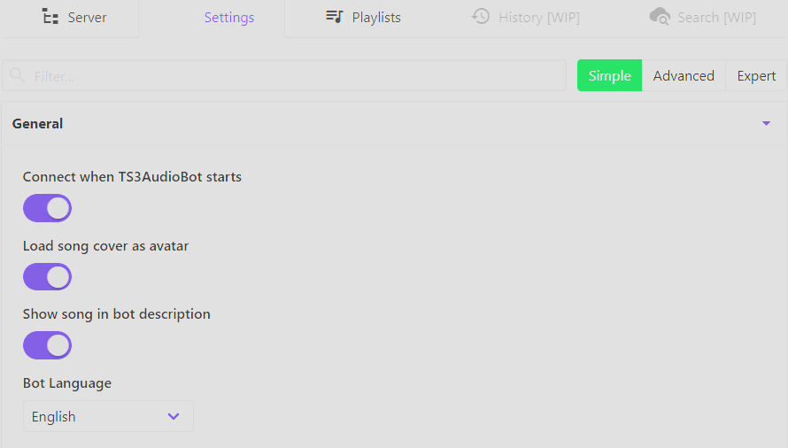
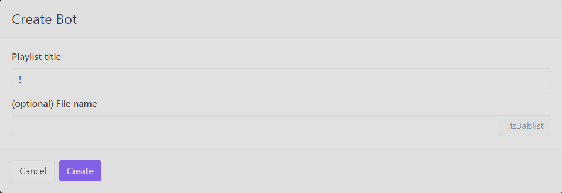

# 引言
部署好了 TeamSpeak 服务器，本着折腾精神，同时也可以为服务器增添点乐趣，我找到了这个项目
::github{repo="ZHANGTIANYAO1/TS3AudioBot-NetEaseCloudmusic-plugin"}
这是 [TS3AudioBot](https://github.com/Splamy/TS3AudioBot) 的网易云插件版本，提供了对网易云音乐的支持，也就是说服务器内的成员可以点歌♫(/^^)/♫  :spoiler[只要网易有版权的话]

还需要部署这个项目 [NeteaseCloudMusicApi](https://www.npmjs.com/package/NeteaseCloudMusicApi) ，这是为了给机器人提供 API 支持，当然你也可以使用公用 API，但我更加推荐自建 API 服务*(・ω・)👉*

# 部署 API

> [!NOTE] NOTE
> 本文基于 Windows 平台撰写，实际部署时请注意操作系统差异！
### 环境依赖

**在开始部署 API 之前，您需要确保系统满足以下要求：**

- **Node.js >= 20**
- **pnpm >= 9**

### [安装 Node.js](https://docs-firefly.cuteleaf.cn/guide/get-started/#%E5%AE%89%E8%A3%85-node-js)

访问 [Node.js 官网](https://nodejs.org/) 下载并安装最新版本的 Node.js。建议使用 LTS 版本。

安装完成后，打开终端或命令提示符，运行以下命令验证 Node.js 是否安装成功：

```bash
node -v
npm -v
```

如果显示版本号，则表示安装成功。

### [安装 pnpm](https://docs-firefly.cuteleaf.cn/guide/get-started/#%E5%AE%89%E8%A3%85-pnpm)

如果您尚未安装 pnpm，可以通过 npm 安装：

```bash
npm install -g pnpm
```

安装完成后，打开终端或命令提示符，运行以下命令验证 pnpm 是否安装成功：

```bash
pnpm -v
```

如果显示版本号，则表示安装成功。

### 防火墙放行

在防火墙开放以下端口以便服务顺利运行

```bash
9987 UDP
30033 TCP
10011 TCP
41144 TCP
3000 TCP+UDP
58913 TCP
8000 TCP+UDP
```

### 部署
新建一个项目文件夹，然后在文件夹里打开 CMD，输入下方命令，开始安装

```bash
npm i NeteaseCloudMusicApi
```

等待安装完成后，在文件夹里编写一个 .bat 脚本，方便后续启动 API 服务

```bat
npx NeteaseCloudMusicApi
```

运行一下 bat 文件，正常情况下应该可以看到如下输出：

```bash
Services starts at localhost:3000
```

这样我们的网易云 API 就搭建好啦🎉

# 部署 Bot

> [!NOTE] NOTE
> 本文基于 Windows 平台撰写，实际部署时请注意操作系统差异！

::github{repo="ZHANGTIANYAO1/TS3AudioBot-NetEaseCloudmusic-plugin"}

点击项目卡片跳转到仓库页面，然后在 releases 页面按照说明下载对应文件，本文使用 3.0.2测试版 - TS3AudioBot_WIN_64.zip 作为演示。

解压文件，然后运行 TS3AudioBot.exe

```bash
INFO|Core| [============ TS3AudioBot started =============]
INFO|Core| [ Date: Monday, 16 February 2026 09:31:44
INFO|Core| [ Version: 0.12.2/master/4c6be036
INFO|Core| [ Build: Release
INFO|Core| [ Platform: Windows 6.2.9200.0 (64bit)
INFO|Core| [ Runtime: .NET Framework 3.1.32 ServerGC:True GC:SustainedLowLatency
INFO|Core| [ Opus: libopus 1.2.1-fixed (x64)
INFO|Core| [==============================================]
INFO|Core| Starting Webserver on port 58913
It seems like there are no bots configured.
Fill out this quick setup to get started.
Please enter the ip, domain or nickname (with port; default: 9987) where to connect to:
```

这里是让我们输入 TeamSpeak 服务器的 IP 地址，也支持域名以及昵称，默认连接 9987 端口，输入好之后回车

```bash
Please enter the server password (or leave empty for none):
```

这里是填写 TeamSpeak 服务器密码，没设置的直接回车即可，设置了的输入好之后回车

```bash
09:37:58.7697| INFO|Core| Bot "default" connecting to "localhost:9987"
09:37:59.2042| INFO|Core| Client connected.
```

看到如上输入就代表着 Bot 已经加入你的服务器了🎉

### 接入网易云 API 

打开 Bot 文件夹，找到 plugins 文件夹，修改 neteaseApi 参数

```yml
version: 1
playMode: SeqPlay
neteaseApi: http://localhost:3000
isPrivateFMMode: false
isQrlogin: false
cookieUpdateIntervalMin: 30
autoPause: true
```

前面我们本地部署的 API 运行在 http://localhost:3000，因此我们就修改为此地址。

# 配置 Bot
Bot 默认启动在端口 58913 上，使用云服务器的宝子可以用你服务器的公网 IP 访问这个端口即可看到 Web 配置页面~

如图所示我们需要填写 Client UID，获取它的方式也很简单，打开 TeamSpeak 客户端，连接到你的服务器，找到刚刚加入频道的 Bot 并发起文字聊天，输入下方指令：

```bash
!api token
```

然后机器人就会返回一个 Client UID，将这个 UID 填入即可开始配置 Bot 了。

点击 Jump to your Bots overview，然后点击空白图标 :spoiler[其实是设置]


在 Server 选项卡里可以修改 Bot 所在频道以及名称。


Settings 选项卡可以修改服务器地址 密码 频道密码以及机器人音量。


Playlist 选项卡可以播放本地音乐，如图所示 File Name 处只要填写音频文件的绝对路径即可~

例如：C:\Users\Gucrin\Music\NURTURE MEGAMIX.mp3

### 登录网易云
有三种方式可以登录网易云：

二维码登录：(输入指令后扫描机器人头像二维码登录)  

- `!yun login netease qr`

验证码登录：

- `!yun login netease sms <手机号> [验证码]`

- 先使用 `!yun login netease sms <手机号>` 获取验证码
- 在使用 `!yun login netease sms <手机号> <验证码>` 登录

Cookie登录:

- `!yun login netease cookie <Cookie>`

### Bot 命令

先来学习一下命令用法吧

| 命令    | 命令格式                                                    | 注释         |
| ------- | ---------------------------------------------------------- | ------------ |
| login   | `!yun login <登录方式>`                              | 登录         |
| play    | `!yun play <歌单/专辑/歌曲/歌名/歌曲ID>`              | 播放         |
| add     | `!yun add <歌单/专辑/歌曲/歌名/歌曲ID>`               | 下一首播放   |
| next    | `!yun next`                                                | 下一首       |
| gedan   | `!yun gedan <歌单/歌单名/歌单ID> [长度(max/1-9999)]`  | 歌单         |
| zhuanji | `!yun gedan <专辑/专辑名/专辑ID> [长度(max/1-9999)]`  | 专辑         |
| mode    | `!yun mode <播放模式>`                                      | 播放模式     |
| list    | `!yun list`                                                 | 查看播放列表 |
| clear   | `!yun clear`                                                | 清空播放列表 |
| stop    | `!yun stop`                                                 | 停止播放     |
| start   | `!yun start`                                                | 开始播放     |
| status  | `!yun status`                                               | 查看登录状态 |
| reload  | `!yun reload`                                               | 重载插件配置 |

播放模式

| 模式 | 注释     |
| ---- | ------- |
| `0`  | 顺序播放 |
| `1`  | 顺序循环 |
| `2`  | 随机播放 |
| `3`  | 随机循环 |

例如：

```TEXT
!yun play Shelter
```

即可播放名为 Shelter 的歌曲

# 总结


现在你的点歌机器人可以正常工作啦~ 这次我们使用了两个项目以完成目标，感谢二位项目作者的付出！
